# Hồ sơ chuẩn bị: RAG cục bộ, tái thiết kế UI và tự luận qua ảnh

> Trạng thái: kế hoạch, **chưa tích hợp provider, chưa thêm secret, chưa đổi schema hay RLS**.  
> Cập nhật: 2026-07-25. Đọc cùng `AGENTS.md`, `docs/DESIGN_SYSTEM.md`, `docs/ESSAY_GRADING.md` và `docs/RUNBOOK.md` trước khi làm tiếp.

## 1. Mục tiêu và ranh giới

Ba hạng mục độc lập để tránh một lần làm quá rộng và tốn context/token:

| Hạng mục | Mục tiêu | Không làm trong đợt này |
|---|---|---|
| RAG cho Codex | Tìm đúng file/context trước khi sửa repo | Không đưa RAG vào website học sinh |
| Thiết kế web mới | Làm dashboard và luồng làm bài rõ ràng hơn, vẫn dùng design token hiện có | Không thay framework hoặc redesign toàn bộ trong một PR |
| Tự luận qua ảnh | Học sinh nộp ảnh bài làm, OCR thành bản nháp, AI đề xuất chấm theo rubric | Không cho AI tự chốt điểm, không gửi key từ browser |

Mọi hạng mục phải tách UI khỏi database/RLS audit. Không chạy migration cũ hay `database/SUPABASE_SCHEMA.sql`.

### Tiến độ frontend ngày 2026-07-26

Đã triển khai phần UI có thể dùng an toàn với dữ liệu hiện có, không chạy SQL,
không đổi schema/RLS và không gọi provider:

- `/admin/analytics`: workspace **Kết quả lớp** có lọc lớp, `simulation/practice`,
  khoảng thời gian, mức hoàn thành, điểm trung vị đã chốt, hàng chờ tự luận,
  bảng học sinh responsive và drill-down tới attempt.
- `/admin/exams/[examId]/results`: hàng chờ theo từng đề với lọc trạng thái,
  tìm theo tên, mobile card/desktop table và CTA mở màn giáo viên duyệt.
- `/student`: workspace **Hôm nay** ưu tiên attempt đang làm, bài còn hạn và
  phản hồi đã được release; không truy vấn điểm thi thử cho thẻ cập nhật, không
  biến điểm `NULL`/pending thành 0, không phụ thuộc RPC homework 20260722 chưa
  rollout và không cho tiếp tục bài đã quá hạn/hết thời gian.

Chưa triển khai upload ảnh, OCR, queue/provider AI, storage hoặc UI ảnh thật vì
các phần đó thuộc giai đoạn 2–5 và cần privacy, schema, RLS, worker cùng JWT/E2E
đạt trước. Không dùng mock để làm người dùng hiểu nhầm rằng ảnh đã được lưu/xử lý.

## 2. RAG cục bộ đã chuẩn bị

Script: `scripts/ai-rag.mjs`. Cache/vector: `.ai-cache/rag/` (đã ignore Git). Nó chỉ cho phép Ollama loopback; source không bị gửi sang dịch vụ cloud.

```powershell
# Cài Ollama theo hướng dẫn chính thức (một lần), sau đó:
ollama pull nomic-embed-text
ollama serve

node scripts/ai-rag.mjs doctor
node scripts/ai-rag.mjs index
node scripts/ai-rag.mjs query "dashboard kết quả homework theo lớp" --top 6 --max-bytes 60000

# Chỉ sau khi chọn được seed từ RAG:
node scripts/ai-context.mjs --file src/duong-dan-file.tsx --max-bytes 120000
```

Quy tắc tiết kiệm token:

1. Task rõ file/route/table: dùng thẳng `ai-context`, không gọi RAG.
2. Task rộng: RAG tối đa 6 excerpt, tối đa 60 KB; chỉ mở file seed và dependency pack.
3. Không dùng `--changed` hoặc quét toàn repo khi không cần.
4. Tách mỗi đợt thành một phạm vi: UI, database/RLS hoặc provider AI.
5. Ghi rõ token budget ở đầu task nếu cần giới hạn cứng.

## 3. Hướng thiết kế website mới

### Ý tưởng sản phẩm

Thiết kế theo ba workspace, không trộn dữ liệu/quyền:

```text
Học sinh: Hôm nay -> Việc cần làm -> Tiến độ/nhận xét
Giáo viên: Lớp -> Cần chú ý -> Bài cần duyệt -> Xu hướng
Quản trị: Toàn cục -> Quyền/cấu hình -> Kiểm soát vận hành
```

Điểm chính là “việc cần làm tiếp theo”, không phải dồn nhiều bảng/thẻ thống kê vào đầu trang.

### Màn hình ưu tiên theo thứ tự

1. **Giáo viên / Kết quả lớp**: bộ lọc lớp + loại hoạt động + thời gian; hàng đầu là mức hoàn thành, điểm trung vị, số bài cần xem; bảng học sinh có trạng thái `cần hỗ trợ / ổn định / nổi bật`, drill-down vào attempt.
2. **Giáo viên / Hàng chờ tự luận**: chỉ bài đúng scope lớp/đề; xem ảnh, OCR, rubric và gợi ý chấm cạnh nhau; chênh lệch hoặc confidence thấp phải nổi bật.
3. **Học sinh / Hôm nay**: đề/bài tập còn hạn, tiếp tục attempt dở, phản hồi đã được release. Không lộ đáp án hay điểm pending.
4. **Trang làm tự luận**: nhập văn bản như hiện tại là fallback; bổ sung upload ảnh có preview, trạng thái xử lý, lỗi rõ ràng và nút thay ảnh.

### Quy tắc UI không đổi

- Giữ token màu, sidebar, MathJax/TikZ/Markdown và light/dark trong `docs/DESIGN_SYSTEM.md`.
- Một CTA chính mỗi panel; bảng admin có chiến lược mobile (scroll/card/cột ưu tiên).
- Mọi dashboard phải có loading, empty, error, retry và ghi rõ phạm vi dữ liệu (“lớp nào”, “thời gian nào”).
- Không xem việc ẩn menu là quyền truy cập: server/RLS vẫn scope theo `classes.teacher_id`.

### Thứ tự thực hiện UI

1. Audit route/component hiện có với một context pack gọn.
2. Wireframe bằng component/pattern hiện tại, review desktop + mobile + dark mode.
3. Làm **một** route giáo viên trước; không chạm DB nếu query hiện tại đủ.
4. Sau khi có metric đã định nghĩa rõ mới thiết kế RPC/view tổng hợp; không trộn exam attempt với homework attempt tùy tiện.

## 4. Kiến trúc tự luận bằng ảnh (đề xuất)

### Luồng an toàn

```mermaid
flowchart LR
  S["Học sinh upload ảnh"] --> V["Server: auth, ownership, kích thước/MIME, scan"]
  V --> ST["Storage private, URL ngắn hạn"]
  ST --> O["OCR provider qua server"]
  O --> N["Chuẩn hóa text + math, tạo hash"]
  N --> G["Grading provider qua server"]
  G --> P["Validate rubric/schema/giới hạn điểm"]
  P --> Q["pending_review hoặc cần xem lại"]
  Q --> R["Giáo viên duyệt/sửa rồi trusted RPC chốt"]
```



Không được gọi OCR hay chấm trực tiếp từ client. Browser chỉ upload asset thông qua endpoint/RPC đã kiểm tra actor và attempt; provider key sống ở môi trường server-only.

### Provider adapter

Tách adapter để đổi provider mà không đổi quyền/chấm:

```text
src/lib/essay-ai/
  contracts.ts        # OcrResult, GradeSuggestion, ProviderError
  ocr-provider.ts     # interface OCR
  grading-provider.ts # interface grading theo essay-grade-result.v1
  redaction.ts        # loại metadata/PII có thể nhận diện
  validation.ts       # hash, rubric version, criterion, score cap
```

- OCR: chọn **một** vision model của OpenAI *hoặc* Gemini sau benchmark ảnh chữ viết tay tiếng Việt/công thức. Không cần gửi cả prompt chấm sang OCR.
- Chấm: DeepSeek chỉ nhận `grading_ref`, rubric/version, đề cần thiết, answer OCR đã chuẩn hóa và không nhận profile/email/lớp/student id.
- Tên model không hard-code khắp source; allowlist server-side và cấu hình provider là secret server-only.
- Không tin output OCR hay AI: coi như input không tin cậy, có thể chứa prompt injection hoặc sai công thức.

### Secret và dữ liệu nhạy cảm

Không có ngoại lệ cho việc “gửi key lên ChatGPT/Gemini”. Đúng là:

```text
Browser -> API server của website -> provider API
                   ^
         key chỉ ở biến server-only / secret manager
```

- Không đưa key vào `NEXT_PUBLIC_*`, localStorage, source, log, prompt, ảnh chụp hay database.
- Không gửi URL Storage public; dùng bucket private, signed URL ngắn hạn hoặc stream qua server.
- Cấm ảnh EXIF/GPS, giới hạn định dạng `image/jpeg|png|webp`, số trang/kích thước/pixel và chống decompression bomb.
- Có consent/policy lưu ảnh, TTL/xóa ảnh, audit provider request (chỉ metadata/hash/cost; không log ảnh/text đầy đủ).
- Chỉ gửi sau khi được chấp thuận xử lý dữ liệu học sinh bằng provider bên ngoài và kiểm tra điều khoản/region/data retention của từng provider.

## 5. Chấm tự động: ranh giới không được phá

`AGENTS.md` hiện quy định AI **không tự chốt điểm**. Vì vậy đợt đầu chỉ có thể:

- OCR tạo transcription có confidence.
- DeepSeek tạo `essay-grade-result.v1` dưới dạng **gợi ý** theo rubric.
- Rule server xác minh `grading_ref`, hash nội dung, rubric version, criterion đầy đủ/không trùng, tổng điểm và score cap.
- Confidence thấp, OCR mơ hồ, công thức không đọc được, prompt injection hoặc sai schema => `needs_human_review`.
- Giáo viên có thể duyệt hàng loạt các gợi ý đủ điều kiện, nhưng RPC vẫn ghi audit của người duyệt và server mới tính điểm cuối.

Đây vẫn giảm phần lớn thời gian chấm mà không cho một model quyết định điểm một mình. Nếu muốn đổi sang auto-final grade sau này, phải có quyết định sản phẩm/pháp lý riêng, dataset đánh giá, threshold theo môn, rollback và sửa rõ các bất biến trong `AGENTS.md` trước khi code.

## 6. Dữ liệu/schema cần thiết (chưa tạo migration)

Không nhét ảnh hoặc text OCR vào các cột grading hiện tại một cách ngầm định. Một migration mới sau này cần thiết kế tối thiểu:

| Nhóm | Dữ liệu dự kiến |
|---|---|
| `essay_answer_uploads` | answer id, private storage path, content hash, MIME/size, trạng thái upload/OCR, xóa sau hạn |
| OCR snapshot | normalized text, text hash, engine/model/version, confidence, cảnh báo; versioned theo lần upload |
| AI suggestion | provider/model/version, input hash, response hash, cost/tokens, `essay-grade-result.v1`, trạng thái validate; không lưu secret |
| audit | actor tạo/duyệt, thời điểm, reason override, rubric version, review hash |

RLS: student chỉ upload/read asset của attempt chính mình khi attempt còn hợp lệ; staff chỉ đọc đúng đề/lớp; không có direct update trường điểm/grading từ client. Storage policy phải kiểm tra ownership tương đương database, không chỉ dựa vào path client gửi.

## 7. Worker, retry và chi phí

OCR/chấm là tác vụ không đồng bộ, không để request submit chờ nhiều phút:

1. Submit lưu attempt/asset và tạo job idempotent theo `answer_hash + rubric_version + upload_hash`.
2. Worker server xử lý OCR rồi chấm; exponential backoff, timeout, giới hạn retry và dead-letter state.
3. Re-upload hoặc đổi rubric hủy/invalidate suggestion cũ; không reuse kết quả sai version.
4. Queue theo user/lớp để tránh spam; quota số ảnh/trang/ngày và cost cap theo provider.
5. Hiển thị cho học sinh `Đã nhận ảnh / Đang nhận dạng / Đang chờ duyệt`, không hiển thị raw score trước policy release.

Theo dõi: success rate OCR, tỷ lệ `needs_human_review`, thời gian hàng chờ, teacher override rate, cost/attempt và sai lệch benchmark. Không tối ưu model theo cảm giác.

## 8. Benchmark bắt buộc trước chọn model

Tạo fixture **đã ẩn danh và có quyền sử dụng**, không dùng bài học sinh thật trong chat/log. Chia theo:

- chữ viết tay rõ/mờ, ảnh nghiêng/thiếu sáng, nhiều trang;
- biểu thức LaTex/toán, hình vẽ, gạch xóa;
- môn/khối/rubric khác nhau;
- câu trả lời đúng, thiếu ý, sai logic, prompt injection cố ý.

Đo riêng OCR (character/math accuracy, lỗi mất dòng) và grading (criterion agreement với ít nhất hai người chấm, calibration confidence, override rate, latency, chi phí). Chỉ chọn OCR provider và DeepSeek model sau khi có số liệu; không mặc định model “mới nhất” hay rẻ nhất là tốt nhất.

## 9. Giai đoạn triển khai khi tiếp tục

| Giai đoạn | Deliverable | Gate dừng |
|---|---|---|
| 0 | Chốt privacy/consent, retention, provider terms và benchmark fixture | Chưa có phê duyệt xử lý ảnh/PII |
| 1 | Wireframe dashboard + hàng chờ tự luận, không provider | UI làm lộ key/đáp án hoặc phá scope lớp |
| 2 | Upload private + RLS + validation + xóa/TTL | Cross-user/cross-class hoặc signed URL quá rộng |
| 3 | OCR adapter sandbox, fixture ẩn danh | OCR output không version/hash hoặc leak log |
| 4 | DeepSeek suggestion + validator + queue | Có đường nào AI tự ghi score cuối |
| 5 | Teacher review batch + audit + benchmark/cost dashboard | JWT negative/E2E chưa đạt |
| 6 | Pilot lớp nhỏ, rollback/kill-switch | Chưa đạt threshold chất lượng/cost/override |

Mỗi giai đoạn phải là một task riêng, dùng RAG/context giới hạn và chạy đúng verification matrix trong `AGENTS.md`. Không triển khai giai đoạn 2–6 trước khi hardening runtime hiện tại có preflight/postflight/JWT negative test đạt.

## 10. Việc cần chốt từ chủ dự án trước khi viết code

1. Ảnh tự luận áp dụng chỉ `simulation` hay thêm homework sau thiết kế riêng? Hiện mặc định chỉ simulation pilot.
2. Chính sách lưu ảnh: bao lâu, ai xem, có cần cho học sinh xóa/đổi ảnh không?
3. Phê duyệt data processing với OpenAI/Gemini/DeepSeek và giới hạn chi phí tháng.
4. Tiêu chuẩn benchmark và tỷ lệ teacher review bắt buộc theo confidence.
5. Chọn route UI đầu tiên: dashboard kết quả lớp hay hàng chờ tự luận.

## 11. Tình trạng nghiên cứu provider

Thiết kế ở trên cố ý provider-agnostic. Trong phiên chuẩn bị này không có provider API/key nào được gọi. MCP tài liệu OpenAI chưa được phép thêm vì là cấu hình đặc quyền; trước khi triển khai OpenAI/Gemini/DeepSeek, cần xác minh bằng tài liệu chính thức phiên bản hiện tại: API vision/OCR, format ảnh, data retention, region, pricing, rate limit và model allowlist.
