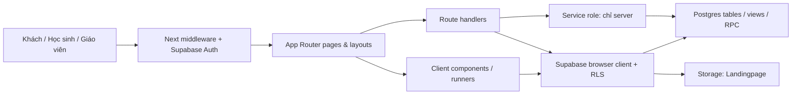

# Bản đồ dự án

## Kích thước source ngày 2026-07-21

| Hạng mục | Số lượng ngày 2026-07-19 |
|---|---:|
| Module TypeScript trong `src` | 168 (41.084 dòng vật lý) |
| Page route | 72 |
| Route handler | 6 |
| Layout | 6 |
| Module client | 120 |
| File source gọi `.from(...)` | 89 |

## Kiến trúc tổng quát



Đây là ứng dụng Next.js monolith. Nhiều page và runner gọi Supabase trực tiếp từ client; vì vậy RLS là một phần của authorization, không chỉ là cấu hình database phụ trợ.

## Cây thư mục cần biết

```text
src/
  app/                 App Router: page, layout, route handler
  components/          UI dùng chung, runner, admin/student/theories
  contexts/            theme và loading
  hooks/               session timeout, anti-cheat
  lib/
    analytics/         tổng hợp năng lực học sinh
    answers/           tải đáp án
    attempts/          view model attempt
    auth/              role, access tier, OTP
    essay-grading/     prompt ẩn danh + parser JSON gợi ý AI
    exam/              tải câu hỏi exam
    homework/          action homework
    theories/          action, parser/export/normalize LaTeX, mastery legacy
    supabase/           browser client
  types/               type dùng chung
  middleware.ts        auth, role, OTP, timeout, redirect
supabase/migrations/   migration gia tăng mới
database/              snapshot/script SQL lịch sử; không phải migration baseline
public/                static assets
ai/                    manifest ngữ nghĩa được review thủ công
scripts/               index/context tool cho AI
docs/                  tài liệu chuẩn
```

## Entrypoint quan trọng

| Nhu cầu | Bắt đầu đọc tại |
|---|---|
| Auth/redirect/role | `src/middleware.ts`, `src/lib/auth/roles.ts`, `src/lib/auth/access.ts` |
| Root providers/theme/math | `src/app/layout.tsx`, `src/app/providers.tsx`, `src/app/globals.css` |
| Student shell | `src/app/(student)/layout.tsx`, `src/components/student/StudentSidebar.tsx` |
| Admin shell | `src/app/admin/layout.tsx`, `src/components/admin/AdminSidebar.tsx` |
| Exam | `src/app/exam/**`, `src/components/ExamRunner.tsx`, `src/lib/exam/questions.ts` |
| Pilot tự luận | `docs/ESSAY_GRADING.md`, `src/app/admin/questions/essay/new/page.tsx`, `src/components/admin/EssayGradingPanel.tsx`, `src/lib/essay-grading/prompt.ts` |
| Practice | `src/app/practice/**`, `src/components/PracticeRunner.tsx` |
| Homework | `src/app/homework/**`, `src/components/HomeworkRunner.tsx`, `src/lib/homework/actions.ts` |
| Knowledge | `src/app/learn/page.tsx`, `src/components/theories/LearningPath.tsx`, `src/types/skill-tree.ts`, `src/lib/theories/actions.ts` |
| Analytics | `src/lib/analytics/student-capability.ts`, admin/student analytics pages |
| Question bank | `src/app/admin/questions/**`, `src/components/admin/QuestionEditor.tsx` |
| Database evolution | `supabase/migrations/**`, sau đó đối chiếu `database/SUPABASE_SCHEMA.sql` |

## Route catalog

Route group `(auth)` và `(student)` không xuất hiện trong URL.

### Public/auth

```text
/
/login
/signup
/complete-profile
/change-password
/auth/callback                    GET route handler
/api/auth/signup                  POST
/api/auth/change-password         POST, self-service password change + server-only flag clear
/api/enrollments                  POST public
```

### Student shell

```text
/student
/student/exams
/student/practice
/student/homework
/student/history
/student/analytics
/student/settings
```

### Learning và runner

```text
/learn
/learn/map                        redirect compatibility
/learn/theories/[id]              redirect compatibility
/practice
/practice/[attemptId]
/exam/prepare/[examId]
/exam/[attemptId]
/exam/[attemptId]/result
/homework/prepare/[examId]
/homework/[attemptId]
/result/[attemptId]
/leaderboard
/bookmarks
/badges
/goals
```

### Admin

```text
/admin
/admin/access
/admin/analytics
/admin/announcements
/admin/attempts/[attemptId]
/admin/classes
/admin/enrollments
/admin/exams
/admin/exams/create
/admin/exams/[examId]
/admin/exams/[examId]/questions
/admin/exams/[examId]/publish
/admin/exams/[examId]/results
/admin/feedback
/admin/homework
/admin/homework/create
/admin/homework/[id]
/admin/homework/[id]/assign
/admin/homework/[id]/results
/admin/knowledge-links
/admin/knowledge-links/[theoryId]
/admin/landing
/admin/latex-templates
/admin/media
/admin/posts
/admin/posts/new
/admin/posts/calendar
/admin/posts/[id]/edit
/admin/questions
/admin/questions/essay/new
/admin/questions/sources
/admin/reports
/admin/settings
/admin/settings/landing
/admin/settings/sections
/admin/students
/admin/students/[id]
/admin/theories
/admin/theories/new
/admin/theories/import
/admin/theories/export
/admin/theories/[id]/edit
/admin/theories/[id]/edges
/admin/users
/admin/verify-otp
```

Admin API:

```text
/api/admin/send-otp               POST
/api/admin/verify-otp             POST
/api/admin/create-account         POST
```

## Quyền route thực tế trong middleware

| Pattern | Hành vi hiện tại |
|---|---|
| `/`, `/login`, `/signup`, `/auth/callback` | public/special handling |
| `/api/*` | middleware bỏ qua; handler phải tự bảo vệ |
| `/complete-profile` | chỉ user đã auth nhưng chưa có profile |
| `/change-password` | chỉ user bị đánh dấu phải đổi mật khẩu; gọi `POST /api/auth/change-password`, không ghi trực tiếp `profiles.must_change_password` từ client |
| `/admin/verify-otp` | chỉ exact `admin` đã auth, đang hoàn tất thử thách OTP |
| `/admin/*` | auth + `isAdmin(role)`; exact `admin` cần OTP cookie, `teacher` không đi qua OTP nhưng vẫn phải bị scope bởi API/RLS |
| `/student/*`, `/result/*` | student |
| `/learn/*` | student hoặc admin/teacher |
| Các route còn lại | yêu cầu auth nhưng không có role-prefix guard riêng |

Hệ quả: `/exam`, `/practice`, `/homework`, `/leaderboard`, `/bookmarks`, `/badges`, `/goals` không nằm trong student prefix guard. Không giả định role/access tier đã được chặn chỉ vì sidebar không hiện link.

## Luồng dữ liệu chính

### Simulation/practice

Runtime expectation sau cutover đồng bộ `20260721` + `20260722` và source cùng phiên bản:

1. Prepare gọi `get_exam_preparation`; `start_exam_attempt` tạo/resume attempt sau khi kiểm tra mode, publish, feature, thời gian và số lượt ở server.
2. `src/lib/exam/questions.ts` gọi `get_exam_attempt_questions` bằng capability attempt. Payload học sinh không lấy answer key/solution trực tiếp từ `questions`/`answers` trước policy cho phép.
3. Simulation runner chỉ gửi raw answer tới `submit_exam_attempt`; wrapper chấm ba loại cũ ở server, đưa essay có nội dung vào `pending_review` và không công bố điểm khi grading/release policy chưa đạt.
4. Practice chỉ autosave raw draft của attempt đang làm; `submit_practice_attempt` chấm ba loại cũ ở server và trả feedback theo policy practice. Practice từ chối `essay`.
5. Student dashboard/history/result dùng các RPC metadata an toàn thay vì đọc answer key trực tiếp; admin/teacher vẫn phải được scope theo exam/lớp.

Migration 20260721, backfill essay legacy và hardening 20260722 đều **đã được áp** trên Primary (20260721 + backfill ngày 2026-07-22 với hậu kiểm cấu trúc đạt; 20260722 xác minh live ngày 2026-08-06 qua `to_regprocedure` — `submit_exam_attempt_trusted_internal`, `can_edit_homework_question_links`, `get_my_safe_bookmarks` đều tồn tại và chỉ được định nghĩa trong file đó). JWT negative test và E2E vẫn chưa hoàn tất; đó là phần còn chặn rollout, không phải migration. Xem `docs/RUNBOOK.md`.

Chi tiết bắt buộc biết khi sửa hàm chấm: `20260722:1195-1205` **RENAME** `submit_exam_attempt(text,jsonb)` thành `submit_exam_attempt_trusted_internal` rồi bọc bằng `submit_exam_attempt` mới lo gating công bố điểm. Thân hàm chấm đang chạy vì thế là của `20260721`, dưới tên `_trusted_internal`. `CREATE OR REPLACE` wrapper là mất gating điểm.

### Pilot tự luận simulation

1. Admin/teacher tạo `essay` + đáp án tham chiếu + rubric ở `/admin/questions/essay/new` qua RPC `create_essay_question`.
2. Tạo đề simulation xếp `multiple_choice` vào phần 1, `true_false` phần 2, `short_answer|essay` phần 3; essay dùng **tổng thang điểm rubric** làm trọng số (`rubricTotal()` trong `src/lib/exam/scoring.ts`), khớp ngưỡng 0,0001 của `ESSAY_RUBRIC_SCORE_MISMATCH`.
3. Học sinh nhập văn bản/LaTeX; submit RPC ghi answer hash/rubric version và trạng thái chờ duyệt.
4. Admin results dẫn tới attempt detail. `EssayGradingPanel` tạo gói không kèm định danh, giáo viên copy sang AI và paste JSON về.
5. Parser kiểm tra schema/ref/rubric/criteria/score. Giáo viên tự sửa rồi gọi `review_essay_answer`; RPC ghi `essay_grading_reviews` và tính lại điểm thang 10.

Luồng copy/paste thủ công ở bước 4–5 vẫn là luồng chính và vẫn dùng được. Từ 2026-08-04 có thêm luồng tự động song song: `src/lib/essay-ai/worker.ts` gọi `get_essay_grading_package` → DeepSeek → `decideFinalization()` → `ai_finalize_essay_answer`, kích hoạt qua `POST /api/essay-ai/grade-queue` (bearer `CRON_SECRET`). Bài AI chốt mang `grading_status='ai_graded'`, phân biệt với `approved` của người duyệt. **`ESSAY_AI_AUTO_FINALIZE` đã bật từ 2026-08-06** (quyết định chủ dự án). Cổng chặn thực tế giờ là `override-guard.ts`: chưa đủ 20 bài đối chiếu thì mọi bài vẫn về `pending_review`. Lý do và ràng buộc đi kèm ở `AGENTS.md` mục 4.

Schema/RPC essay 20260721, 20260722 và 20260804 đều đã live với postflight cấu trúc đạt; `20260805_essay_ai_usage.sql` chưa áp. Runtime an toàn đầy đủ vẫn phụ thuộc deploy source đồng bộ và JWT/E2E. Xem [`ESSAY_GRADING.md`](ESSAY_GRADING.md) cho luồng thủ công và [`ESSAY_AUTO_GRADING_PLAN.md`](ESSAY_AUTO_GRADING_PLAN.md) cho luồng tự động.

### Homework

1. Admin tạo `homeworks` và snapshot `homework_questions`.
2. Admin tạo assignment + recipient theo lớp/học sinh.
3. Prepare tìm recipient/assignment và tạo/resume `homework_attempts`; RLS/hardening chỉ cho đúng học sinh được giao bắt đầu attempt.
4. Runner lấy bundle qua `get_homework_attempt_questions`, gửi raw answer tới `check_homework_answer` và chốt bằng `submit_homework_attempt`; client không được tự ghi grading fields.
5. Feedback/lời giải được server trả theo `show_feedback_immediately`/`allow_review`; homework từ chối `essay` trong source hiện tại.
6. Metadata học sinh dùng `get_my_homework_question_metadata` và `get_my_homework_answer_metadata`; admin results/analytics vẫn phải tuân theo role/scope của homework domain.

Các bước server-side ở trên dựa vào hardening 20260722, đã live từ trước 2026-08-06. Bản r4 rebuild closed baseline cho `classes`, `exams`, `homeworks`, assignments, recipients và `site_settings`; vẫn chưa có JWT negative test chứng minh mọi đường ghi trực tiếp đã bị khóa.

### RPC trust boundary sau hardening 20260722 (đã live)

| Nhóm | RPC chính | Ranh giới |
|---|---|---|
| Chuẩn bị/làm exam | `get_exam_preparation`, `start_exam_attempt`, `get_exam_attempt_questions` | Xác thực actor, mode/feature/attempt ownership; trả payload theo capability attempt |
| Nộp simulation/practice | `submit_exam_attempt`, `submit_practice_attempt` | Chấm tại server; simulation giữ điểm `NULL` khi essay còn chờ và chỉ công bố theo policy |
| Kết quả/leaderboard | `get_my_exam_answer_metadata`, `get_simulation_leaderboard` | Chỉ dữ liệu của actor hoặc simulation đã đủ điều kiện release/scope |
| Làm homework | `get_homework_attempt_questions`, `check_homework_answer`, `submit_homework_attempt` | Kiểm tra recipient/owner, chấm server và áp feedback/review policy |
| Metadata homework | `get_my_homework_question_metadata`, `get_my_homework_answer_metadata` | Tránh để student đọc trực tiếp link/key quản trị |
| Bookmark | `get_my_safe_bookmarks` | Chỉ bookmark của actor; không dùng bookmark để mở answer key |

`student_has_feature` là gate server-side cho ba luồng làm bài. `history` và `analytics` vẫn còn P1 vì entitlement chưa được enforce server-side đầy đủ. Source admin coi `teacher` như staff ở nhiều nơi nhưng homework policy/helper còn exact `admin`; không coi hai semantics này đã thống nhất.

### Knowledge

1. `theories` tạo cây qua `theory_edges`.
2. Mỗi theory có `knowledge_blocks` và `knowledge_block_edges`.
3. `question_knowledge_links` nối question với theory/block/cognitive level.
4. `/learn` ghép content, khâu học trong bài (`learning-stage.ts` + `TheoryStages`), homework target và activity. Chế độ Sơ đồ ReactFlow đã gỡ 2026-08-11; `/learn/map` và `/learn/graph` cũ redirect về `/learn`.

## Fast path khi sửa lỗi

| Triệu chứng | File seed | Bảng/miền cần kiểm tra |
|---|---|---|
| Sai điểm/nộp bài | runner tương ứng + prepare page | attempts, answers, question snapshot, RLS |
| Tự luận chờ mãi/sai gợi ý | `EssayGradingPanel`, attempt detail, prompt parser | configs, answer hash/rubric version, review RPC, grading status |
| Lẫn thi thử/ôn tập | list/prepare/result + `ActiveExamBanner` | `exams.exam_mode` |
| Homework sai tiến độ | homework runner + admin results | homework questions/attempt counters |
| Sai quyền | middleware + page/action + RLS | profiles, classes, site_settings |
| Dashboard sai thống kê | analytics service + page | cả exam và homework domains |
| Kiến thức không hiện | `/learn`, theory actions, `LearningPath`, `TheoryStages` | theories, blocks, edges, links |
| Math/TikZ lỗi | `MathContent`, `TikzRenderer`, theory LaTeX libs | content/solution/tikz URL |

Lệnh tạo dependency/data neighborhood chính xác hơn:

```powershell
node scripts/ai-index.mjs
node scripts/ai-context.mjs --file src/components/HomeworkRunner.tsx
node scripts/ai-context.mjs --table homework_attempts --depth 1
```

## Hotspot cần thận trọng

- `src/middleware.ts`: auth, role, OTP, timeout và redirect cùng một chỗ.
- `src/lib/theories/actions.ts`: nhiều domain cũ/mới, view/RPC/mastery.
- Các runner: state lớn, autosave, chấm điểm và submit.
- `supabase/migrations/20260721_essay_assisted_grading.sql`: pilot simulation chạm constraint, trigger, RLS và RPC; đã apply/postflight cấu trúc ngày 2026-07-22 nhưng chưa JWT/E2E.
- `supabase/migrations/20260722_runtime_security_hardening.sql`: rebuild policy/grant core, ownership question và RPC capability cho simulation/practice/homework; đã áp, chưa JWT negative test. Nó RENAME `submit_exam_attempt` thành `submit_exam_attempt_trusted_internal` rồi bọc lại, nên sửa hàm chấm phải sửa hàm `_trusted_internal` — xem `docs/SCORING.md`.
- `supabase/migrations/20260806_moet_scoring_scale.sql`: bậc thang Đúng/Sai cho **cả ba luồng chấm**, và trọng số thang Bộ GD&ĐT **chỉ cho đề thi thử** (`exams.scoring_profile = 'moet_standard'`; cột này thêm ở đây, độc lập với `exam_mode`). `CREATE OR REPLACE` ba hàm chấm, nên mọi sửa đổi hàm chấm sau này phải rebase trên file này, không trên 20260721/20260722.
- `src/components/admin/EssayGradingPanel.tsx`: dữ liệu rubric/reference/bài làm đi qua clipboard; không thêm định danh hoặc tự động chốt điểm.
- `src/app/learn/page.tsx`: ghép nhiều bảng/domain trong một client workspace.
- Trang admin exam/question/report: nhiều query và lint debt.
- `database/SUPABASE_SCHEMA.sql`: snapshot lớn nhưng không đồng bộ đầy đủ với migration mới.
